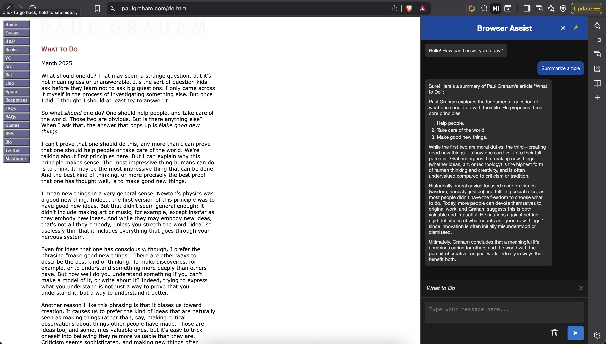

# Browser Assist

A browser extension that embeds an AI assistant directly in your browser sidebar to help you understand and interact with web content.



*Browser Assist sidebar in action*

## Features

- Chat with an AI assistant while browsing the web
- Include content from current and multiple webpages in your conversations
- Dark/light theme toggle
- Markdown rendering support
- Seamless sidebar integration
- Local API key storage for security

## How It Works

Browser Assist creates a sidebar in your browser that provides an AI assistant powered by OpenAI's API. Key capabilities include:

1. **Webpage Context**: Include content from your current webpage or multiple pages in your conversation
2. **Persistent Conversations**: Chat history is maintained throughout your browsing session
3. **Context-Aware**: The assistant understands what you're currently viewing
4. **Privacy-Focused**: Your API key is stored locally and page content is processed client-side

## Installation

### From Source

1. Clone this repository:
   ```
   git clone https://github.com/your-username/browserassist.git
   ```
2. Open your browser and navigate to the extensions page:
   - Chrome: `chrome://extensions/`
3. Enable "Developer mode"
4. Click "Load unpacked" and select the cloned repository folder
5. The Browser Assist icon should appear in your browser toolbar

## Usage

1. Click the Browser Assist icon in your browser toolbar
2. Enter your OpenAI API key on first use (required)
3. Browse any webpage and click "Include current page" to add its content to the conversation context
4. Ask questions about the webpage content or request other assistance
5. Use the clear button to start a fresh conversation

## API Key Setup

This extension requires an OpenAI API key to function:

1. Create or log in to your account at [OpenAI](https://openai.com/)
2. Navigate to the [API keys page](https://platform.openai.com/account/api-keys)
3. Create a new API key
4. Enter this key when prompted by the extension

## Privacy

Browser Assist processes webpage content locally in your browser. Content is only sent to OpenAI's API when you actively engage with the assistant. Your browsing data and API key are not collected by this extension.

## License

[MIT License](LICENSE)

## Acknowledgements

- [OpenAI](https://openai.com/) for the API that powers the assistant
- [Marked](https://marked.js.org/) for Markdown rendering
- [Turndown](https://github.com/mixmark-io/turndown) for HTML to Markdown conversion

---

Made with ❤️ by Akshansh